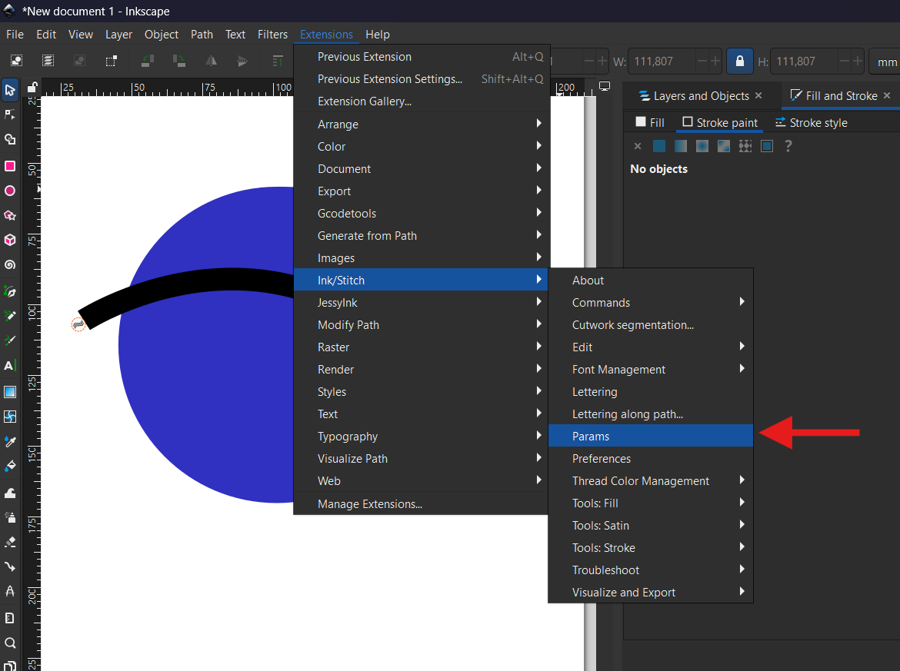
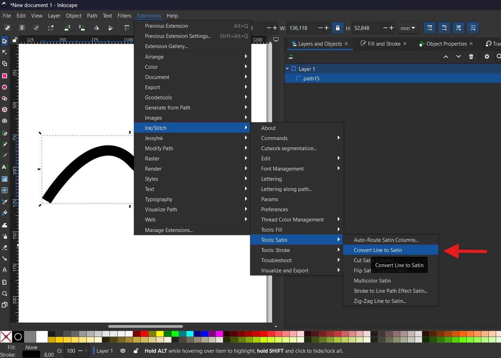
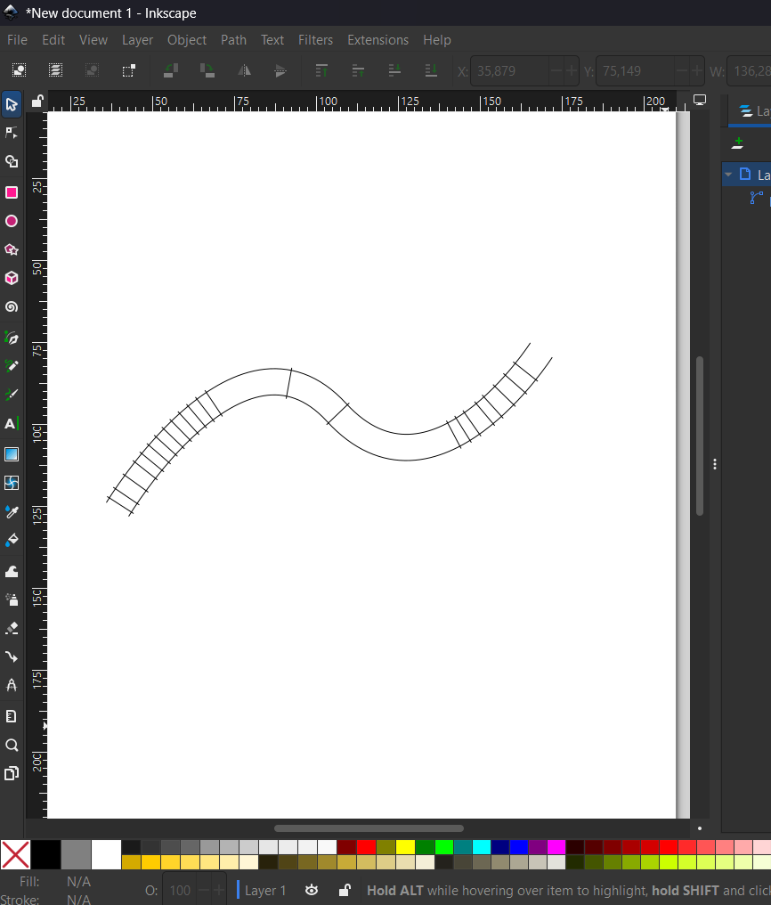
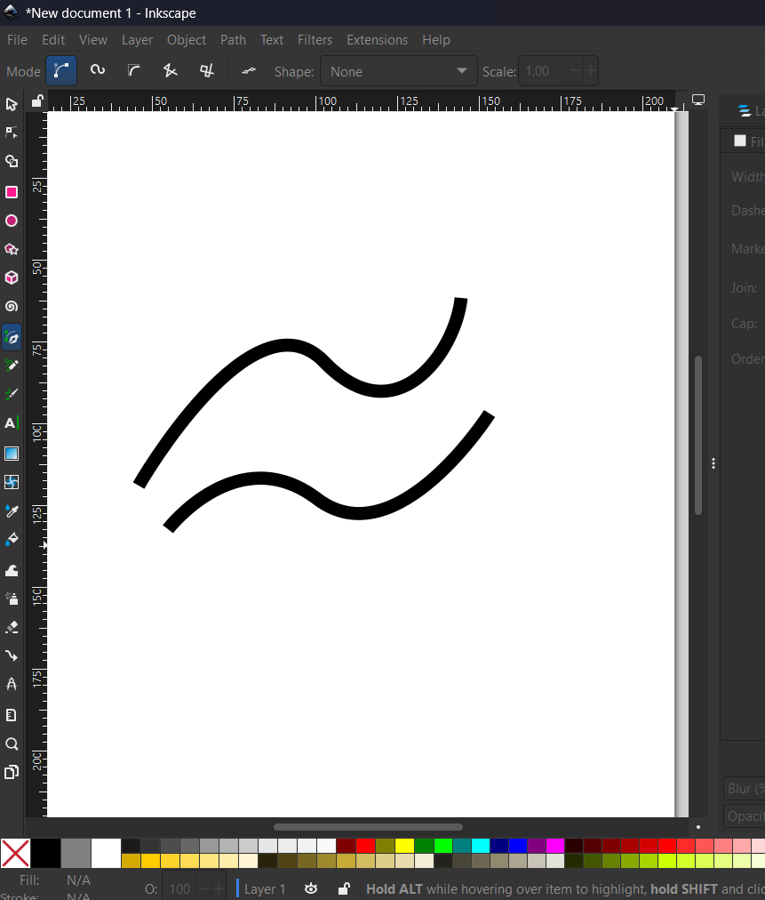
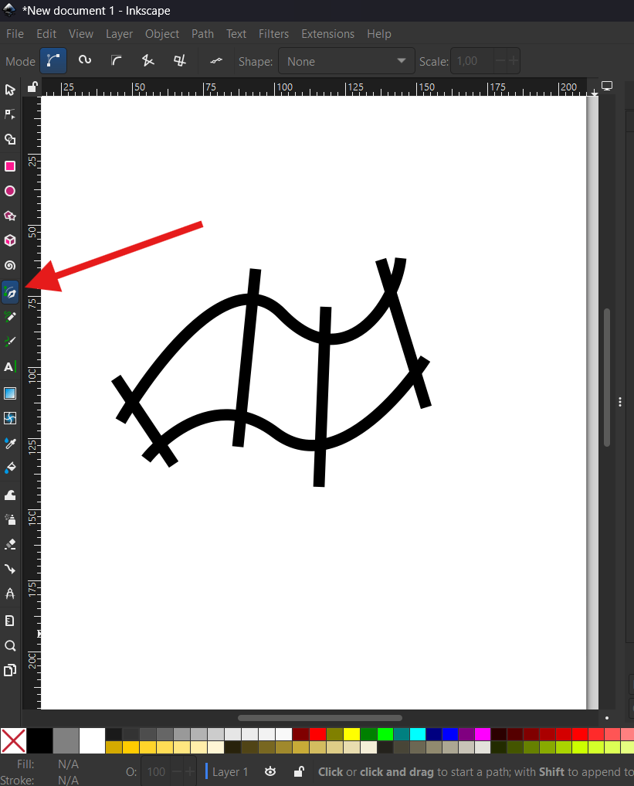
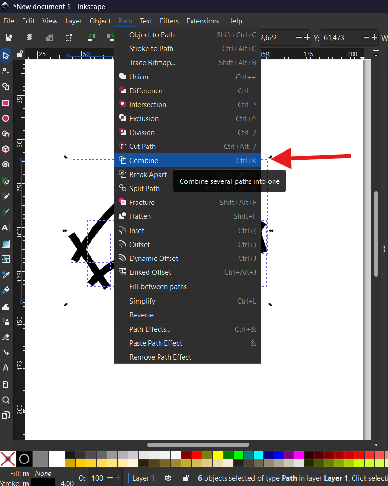

# InkStitch para diseñar bordados

[VOLVER AL PRINCIPIO](/../)

Para la realización de los bordados, cada empresa cuenta con un software generalmente de pago en el que se pueden generar los archivos para cada bordadora, esto es un problema dado que es necesaria una licencia para cada equipo, y estos softwares tienen una limitada compatibilidad con el flujo de trabajo.

Por ello optamos por el uso de la herramienta **Inkscape junto a su Plug-In InkStitch**. Inkscape es un software de diseño vectorial similar a Adobe Illustrator, con la diferencia que es de **código abierto y gratuito**, esto permite que la comunidad agregue funciones que no estaban contempladas o abordadas por los creadores, así se desarrolló InkStitch un plug-in de Inkscape que agrega funciones para el diseño de bordados para maquinas de diferentes fabricantes, entre ellos Singer, Brother, y por supuesto Janome.

## Instalar inkscape

Inkscape se instala de forma gratuita a través de su página web ([https://inkscape.org/es/](https://inkscape.org/es/)) en el apartado de `descarga`, ahí se debe escoger el instalador a usar (suele seleccionarse de manera automática) y descargarlo, ya estando descargado se instala, se aceptan lo terminos de uso y se escoge la carpeta en la que se instalará.
Al finalizar la instalación se abre inkscape y se puede hacer la configuración inicial de la interfaz, al cerrarlo o presionar `New Document` se abrirá una hoja de trabajo para comenzas a usar inkscape (se recomienda usar el software configurado en inglés para facilitar el uso de tutoriales).

 [🔗 Tutorial de la instalación en YouTube](https://www.youtube.com/watch?v=qUHQng7XKlg)

Si bien la interfaz es parecida a illustrator, se recomienda estudiar su uso por medio de tutoriales.

> `nota del autor` a mi en particular me resulta difícil encontrar ciertas configuraciones, pero me he fijado que casi siempre lo que busco está en la pestaña `Object` o `Path`, ahí se pueden abrir las herramientas de trazo/relleno, capas, alineación, booleanas/busca-trazos, etc.

## Instalar Ink/Stitch

Inkstitch se descarga desde su página web [https://inkstitch.org/](https://inkstitch.org/), en ella hay que ir a `Download` y descargar la versión de acuerdo al sistema operativo en el que se esté trabajando (Windows o Mac). En la misma página de inkscape hay un instructivo para descargar e instalar el plug-in.

 [🔗 Tutorial de la instalación en YouTube](https://www.youtube.com/watch?v=CkqyaNlMq_A)

> ***Solo usar en caso de que la página de inkstitch no funcione:***
Permalink más reciente de la página para consultar sobre la instalación en windows: [https://web.archive.org/web/20250719182801/https://inkstitch.org/docs/install-windows/](https://web.archive.org/web/20250719182801/https://inkstitch.org/docs/install-windows/)

## Uso de Ink/Stitch

Tras realizar la instalación ya se puede comenzar a usar para diseñar bordados, inkstitch permite realizar varios tipos de bordado; si bien en esta guía se usa el bordado tipo relleno y tipo satín, existen otras técnicas que puedes explorar en la página web de inkstitch.

Para comenzar se debe abrir inkscape y trabajar en una mesa de trabajo acorde al tamaño del bordado (se recomienda usar el tamaño del bastidor a usar), por defecto el tamaño de la mesa de trabajo en inkscape es A4, el cuál se puede cambiar desde **`File > Document Properties...`** o con el atajo `shift+ctrl+D` en windows.

Para verificar que esté instalado inkstitch en inkscape se abre la barra de **`Extensions`** y debería estar una opción llamada **`Ink/Stitch`**, si no aparece prueba cerrando y volviendo a abrir inkscape, si esto no funciona, prueba volver a instalar inkstitch.

Como primer paso para experimentar, con las herramientas `Rectangle Tool`, `Ellipse/Arc Tool`, o `Star/Polygon Tool`, ubicadas al costado de la mesa de trabajo, dibuja una figura en la mesa de trabajo. Con eso ya se podrá jugar con el siguiente paso.

### Params

En la barra superior de inkscape se abre la siguiente opción **`Extensions > Ink/Stitch > Params`** este abre el principal entorno en el que se trabaja para realizar los planes de bordado. Dependiendo de si la figura dibujada tiene relleno y trazo, o si está seleccionada en el caso de que hayan multiples figuras; inkstitch mostrará una propuesta de plan de bordado y opciones de `Stroke`, `FillStitch` y/o, `Fill Underlay` (por ejemplo si la figura solo tiene trazo no se mostrarán las opciones de *Fill*). Se recomienda experimentar con los parametros de cada opción para aprender sobre el programa.

|**Como encontrar Params**
:----:

Cabe decir que para que se guarden los cambios realizados hay que presionar `Apply and Quit`, de lo contrario no quedarán guardados, sin embargo cada vez que se entre a la pestaña de `Params` se cargaran las opciones por defecto, si se quiere guardar una configuracion para usarla después se tiene que añadir un preset, con el botón `Presets > Add`.

|**Guardar los cambios**
:----:

### Bordado tipo relleno

TODO insertar una fotografia de un bordado relleno real

Cuando se trabaja con figuras con relleno solido es decir que no sean `No paint`, esto aparece en las opciones de relleno y trazo que se pueden desplegar con **`Object > Fill and Stroke...`**; inkstitch interpretará este relleno solido como un espacio a rellenar con bordado, por lo que al abrir **`Extensions > Ink/Stitch > Params`** aparecerán las opciones de `FillStitch` y `Fill Underlay` cada una con distintos parametros para manejar.

> si se desea profundizar en esto se recomienda revisar lo siguiente: [https://inkstitch.org/docs/stitches/fill-stitch/](https://inkstitch.org/docs/stitches/fill-stitch/)

|**Opciones de FillStitch en Params**
:----:

### Bordado tipo satín

TODO insertar una fotografia de un bordado satin real

Otra de las formas más usuales de bordado es el punto satín, en el que las puntadas, en lugar de ser cortas y continuas, van de un extremo al otro de la figura. Para hacer este tipo de bordado en inkstitch se puede hacer tanto de manera automática convirtiendo líneas a trazos, como manual, obteniendo mayor control.

> si se desea profundizar en esto se recomienda revisar lo siguiente: [https://inkstitch.org/docs/stitches/satin-column/](https://inkstitch.org/docs/stitches/satin-column/)

#### Satín automático:

Para realizar un bordado del tipo satín de forma rápida se puede usar la herramienta de **`Extensions > Ink/Stitch > Tools: Satin > Convert Line to Satin`**, para ello se debe seleccionar el trazo que se quiere convertir, puede ser cualquier trazo siempre y cuando tenga un principio y un final, es decir que no sea un trazo cerrado, además este debe tener grosor y ser solido.

|**Dibujar un trazo con el bezier**
:----:

|**Convertir línea a satín**
:----:

|**Resultado de convertir línea a satín**
:----:

Cuando ya se tenga una línea convertida en satín se va a **`Extensions > Ink/Stitch > Params`** dónde se puede configurar el plan de bordado, en el caso de tener multiples elementos que se quieran configurar por separado, hay que abrir Params con los elementos a configurar seleccionados.

|**Opciones de Satín en Params**
:----:

#### Satín manual:

En cambio si se quiere hacer un satín con mayor control, se pueden dibujar con el bezier los rieles y peldaños (como los del **Resultado de convertir línea a satín**), es importante decir que los rieles son los que delimitan los bordes del satín, y los peldaños marcan el rítmo de las puntadas entre los rieles. Tras dibujar los rieles y peldaños hay que seleccionar los objetos y combinarlos  con **`Path > Combine`**, cuyo atajo es `Ctrl+K`.

|**Dibujar rieles del satín**|**Dibujar los peldaños del satín**|
---|---
|||

|**Combinar los trazos de rieles y peldaños**
:----:

Tras combinar los trazos en un solo objeto, hay que abrir **`Extensions > Ink/Stitch > Params`**, al abrir automáticamente estará activo `Stroke`, para cambiar a satín hay que ir a la pestaña `Satin Column` y marcar el check de `✓ Custom satin column`.

|**Opciones de Satín en Params**
:----:

## Exportar archivo de bordado

Cuando se tenga un plan de bordado listo, y se quiera guardar para mandarlo a la máquina bordadora, hay que guardar el archivo primero como `.svg` de inkscape para guardar el proyecto, y luego como una copia en formato **`.jef`**, nótese que hay múltiples extensiones de archivo, y las que tienen que ver con bordado parten con 'Ink/Stitch:', el **`.jef`** es específico para las bordadoras Janome.

|**Guardar una copia**|**Guardar en formato compatible**|
---|---
|||

Luego el archivo se puede poner en un pendrive y llevar a la máquina.

## Tutoriales recomendados

[🔗 @InkStitch :: Canal de YouTube Oficial](https://www.youtube.com/@InkStitch)

[🔗 @LowTechLinux :: Canal de YouTube Recomendado](https://www.youtube.com/@LowTechLinux)

[🔗 @ProjectAnonymous_Duo :: Canal de YouTube Recomendado](https://www.youtube.com/@ProjectAnonymous_Duo)

---
>documentado por [AndresMartinM](https://github.com/AndresMartinM) 2025
